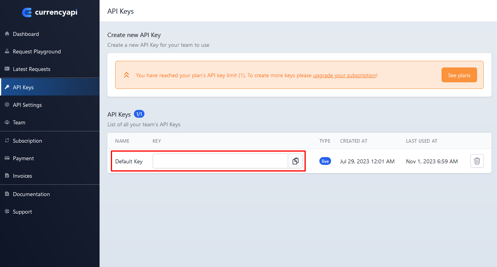
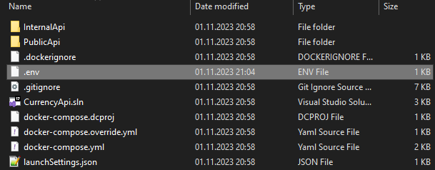
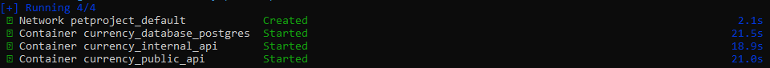

1. Установить [Docker](https://www.docker.com/products/docker-desktop/)

2. Зарегистрироваться на сайте https://currencyapi.com/

3. Получить API ключ по адресу https://app.currencyapi.com/api-keys

   

4. Открыть терминал в нужной директории и ввести команду

```bash
git clone https://github.com/KozhokarIvan/fuse8homeworks2023.git
```

5. Перейти в директорию `fuse8homeworks2023/PetProject`

6. Создать в директории файл `.env` со следующим содержимым:

```ini
INTERNAL_API_CONTAINER_NAME=currency_internal_api
INTERNAL_API_CONTAINER_PORT_GRPC=8088
INTERNAL_API_CONTAINER_PORT=8080

PUBLIC_API_CONTAINER_NAME=currency_public_api
PUBLIC_API_CONTAINER_PORT=5166

DATABASE_CONTAINER_NAME=currency_database_postgres
DATABASE_CONTAINER_PORT=5432


DATABASE_PASSWORD=Password1
DATABASE_USERNAME=postgres
DATABASE_NAME_INTERNAL_API=internalapidb
DATABASE_NAME_PUBLIC_API=publicapidb

CURRENCY_API_KEY=apikey #ОБЯЗАТЕЛЬНО заменить apikey на полученный api ключ из пункта `3`
```

> Можно скопировать блок выше или использовать файл из склонированного репозитория [`./example/.env`](.env)

> ОБЯЗАТЕЛЬНО заменить `apikey`
> Также по желанию можно заменить и остальные параметры

> 

7. По желанию можно отредактировать файлы, изменив настройки приложения

`InternalApi/appsettings.json`

```json
"InternalApi": {
    "Uri": "https://api.currencyapi.com/v3/", //ссылка на внешний api
    "BaseCurrencySettingName": "baseCurrency", //название настройки, которая хранится в базе данных и отвечает за базовую валюту
    "CacheTaskWaitingTimeSeconds": 10, //время, которое дается на обработку задачи на пересчет кэша относительно новой базовой валюты
    "CacheChannelCapacity": 100, //вместимость очереди задач
    "CacheLifeTimeHours": 2 //время жизни кэша в часах
  }
```

`PublicApi/appsettings.json`

```json
"PublicApi": {
    "Uri": "https://api.currencyapi.com/v3/", //ссылка на внешний api
    "CurrencySettingName": "defaultCurrency", //название настройки, которая хранится в базе данных и отвечает за валюту по умолчанию
    "DecimalPlacesSettingName": "currencyRoundCount" //название настройки, которая хранится в базе данных и отвечает за количество десятичных разрядов при округлении курса
  }
```

`docker-compose.yml`

```yml
version: '3.9'

services:
  database_postgres:
    container_name: ${DATABASE_CONTAINER_NAME}
    image: postgres:15.4
    ports:
      - "5433:${DATABASE_CONTAINER_PORT}" # тут можно заменить порт 5433 на другой
    environment:
      POSTGRES_PASSWORD: ${DATABASE_PASSWORD}
    restart: unless-stopped

  internalapi:
  ...
    ports:
      - "8080:${INTERNAL_API_CONTAINER_PORT}" #тут можно заменить порт 8080 на другой
      - "8088:${INTERNAL_API_CONTAINER_PORT_GRPC}" #тут можно заменить порт 8088 на другой
      ...

  publicapi:
  ...
    ports:
      - "5166:${PUBLIC_API_CONTAINER_PORT}" #тут можно заменить порт 5166 на другой
      ...
```

> 5433 - внешний порт для PostgreSQL  
> 8080 - внешний порт internal api для REST Api  
> 8088 - внешний порт internal api для gRPC  
> 5166 - внешний порт public api

8. Запустить docker

9. Из директории `fuse8homeworks2023/PetProject` ввести команду

```bash
docker compose up -d
```

Затем дождаться выполнения



После чего ввести последовательно 2 команды для запуска миграций

```bash
dotnet ef database update -p .\InternalApi\InternalApi.csproj -s .\InternalApi\InternalApi.csproj --connection "Host=localhost;Port=5433;Database=internalapidb;Username=postgres;Password=Password1"
```

```bash
dotnet ef database update -p .\PublicApi\PublicApi.csproj -s .\PublicApi\PublicApi.csproj --connection "Host=localhost;Port=5433;Database=publicapidb;Username=postgres;Password=Password1"
```

> Значение Port брать из файла `docker-compose.yml` (пункт 7)  
> Database, Username, Password из файла `.env` (пункт 6)  
> Если значения в ходе выполнения инструкций не менялись, можно оставить все как есть

10. В браузере открыть http://localhost:5166/swagger для проверки работоспособности `PublicAPI` и http://localhost:8080/swagger для проверки работоспособности `InternalAPI`

> Значения 5166 и 8080 для портов могут отличаться если в файле `docker-compose.yml` они были заменены на другие
