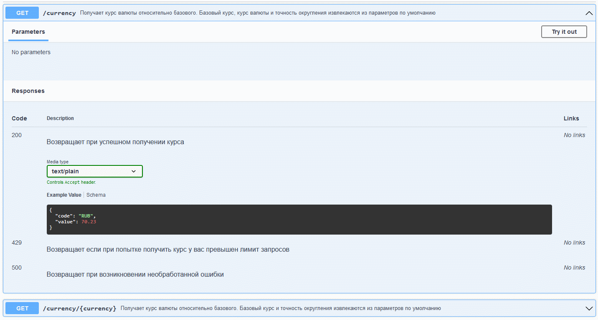
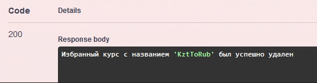

    
<h1>Описание</h1>

    
    
Проект является API для работы с курсами валют и представляет из себя два сервиса: `PublicAPI` и `InternalAPI` которые общаются между собой через gRPC. `InternalAPI` обращается к [стороннему API](https://currencyapi.com/) и кеширует все запросы в базу данных

### Функционал:

- Получение курсов валют
- Сохранение именованной пары валют в избранное для будущего получения курсами
- Изменение настроек
- Изменение базовой валюты и пересчет кеша относительно новой базовой валюты с помощью фоновых задач

### Реализация основного проекта состояла из нескольких этапов:

- Реализация работы с внешним API, логирования запросов, настройка фильтров и конфигурации приложения ([посмотреть задание](Homeworks/Homework3/ReadMe.md))
- Разделение проекта на `InternalAPI` и `PublicAPI`, настройка кэширования запросов в файловую систему, настройка взаимодействия проектов по gRPC ([посмотреть задание](Homeworks/Homework4/ReadMe.md))
- Изменение хранилища кэша с файла на базу данных PostgreSQL, доработка API, добавление функционала для именованных избранных пар валют ([посмотреть задание](Homeworks/Homework5/ReadMe.md))
- Упаковка приложения в docker, реализация пересчета кэша относительно новой базовой валюты ([посмотреть задание](Homeworks/Homework6/ReadMe.md))

### [_Инструкция по запуску_](example/README.md)

    
<h1>Swagger</h1>

    

        

        

            

                

                    

                    
                

                

                    

                    
                

                

                    

                    
                

                

                    

                    
                

                

                    

                    
                

                

                    

                    
                

                

                    

                    
                

                

                    

                    
                

        

        

            

            

                    

                    
            

            

                    

                    
            

            

                    

                    
            

            

                    

                    
            

            

                    

                    
                    
            

        

        

            

            

                    

                    
            

        

    

    

        

        

            

            

                    

                    
            

            

                    

                    
            

            

                    

                    
            

            

                    

                    
            

        
        
        

            

            

                    

                    
            

        

    

    
<h1>Демонстрация работы</h1>

    

        
<h4>Получение настроек</h4>

        
        
    

    

        
<h4>Получение текущего курса валюты по умолчанию относительно курса базовой валюты</h4>

        
        
    

    

        
<h4>Создание фоновой задачи на смену базовой валюты</h4>

        
        
        
        
        
        
    

    

        
<h4>Получение текущего курса валюты по умолчанию относительно курса новой базовой валюты</h4>

        
        
    

    

        
<h4>Создание избранной пары валют для быстрого получения курса</h4>

        
        
        
    

    

        
<h4>Вывод всех избранных пар валют</h4>

        
        
    

    

        
<h4>Вывод параметров избранной пары валют по ее названию</h4>

        
        
        
    

    

        
<h4>Вывод курса для избранной пары валют</h4>

        
        
        
    

    

        
<h4>Удаление избранной пары валют</h4>

        
        
        
    

### Фидбек от ведущего разработчика fuse8 на момент сдачи проекта:

> Понравилось:
> логичное разбиение проектов по папкам, все сервисы, сущности, репозитории находятся именно там где и ожидаешь
> Реализовал правильные репозитории
> Говорил по делу

> Не понравилось:
> В некоторых местах очень не хватало комментариев к тому, что происходит в методах.
> Так же для лучшего понимания кода хорошо бы выносить части кода в приватные методы, не делать всю логику в одном методе
> Небольшой косяк в разделении логики - Избранные по идее должны быть только в PublicApi, InternalApi это просто обертка над внешней апишкой, об Избранных ему знать незачем, хорошо бы переименовать все что связано с Favorite в InternalApi во что то более абстрактное
